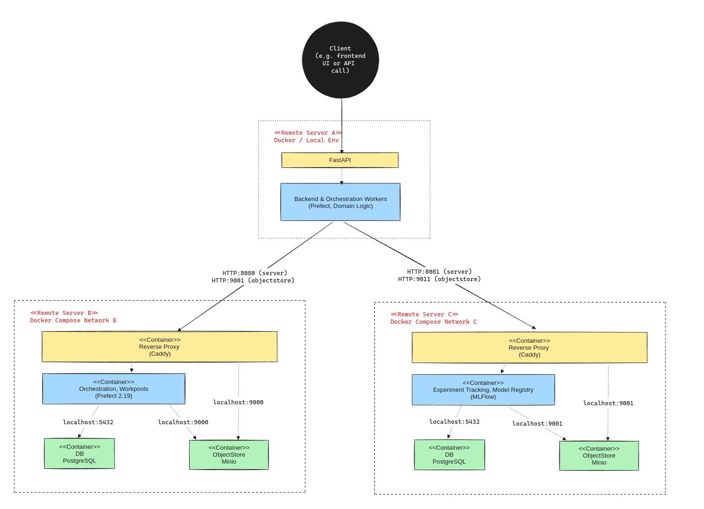
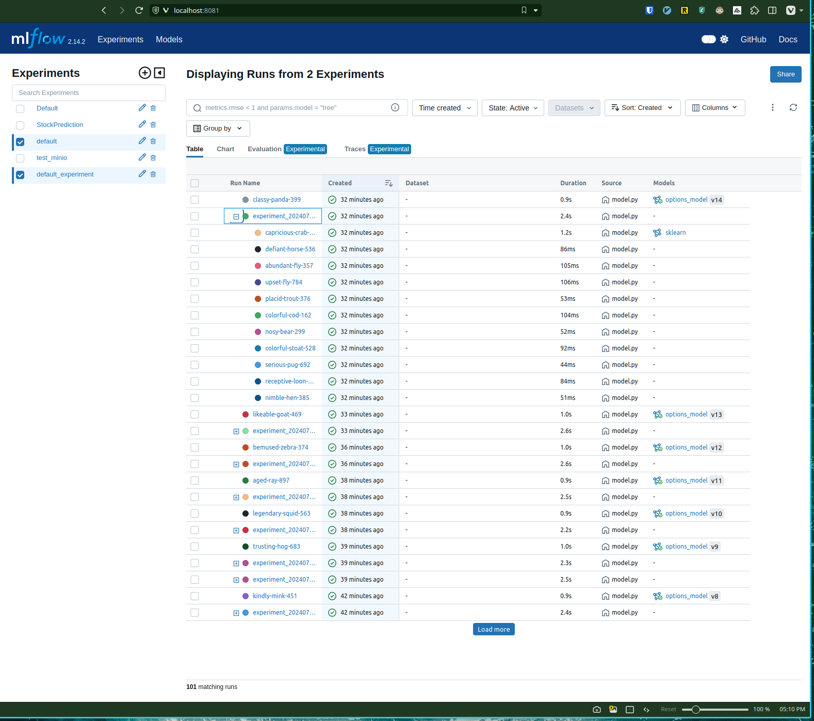
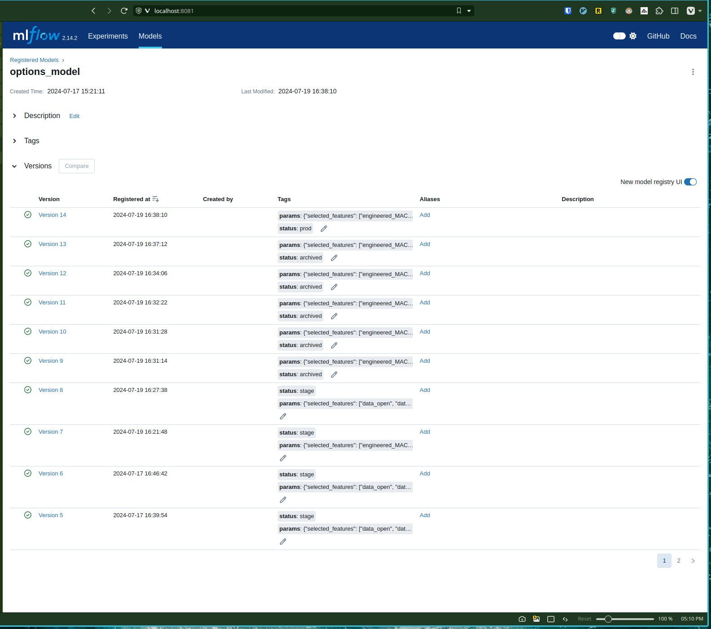
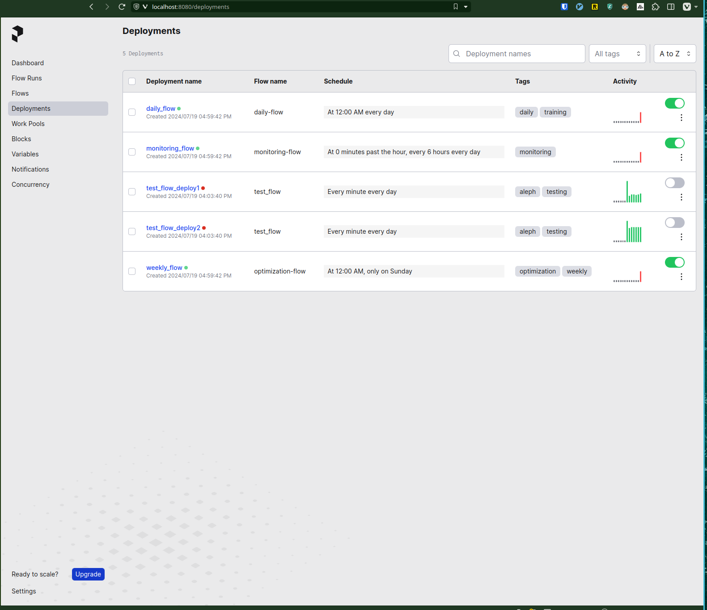

## Problem Description: Prediction Model for 0-DTE Trading

Same-day expiration options trading, also known as 0-DTE (zero days to expiration) trading, is a high-stakes, fast-paced strategy where traders buy and sell options contracts that expire on the same day they're purchased. This approach allows traders to capitalize on short-term price movements and potentially earn significant profits in a matter of hours.

### Challenge
This is a data and modelling problem. Options traders face the challenge of making quick, informed decisions on whether to purchase call or put options with same-day expiration for AAPL stock. The rapidly changing market conditions and the short time frame make it difficult to predict the closing price accurately.

### Solution
This project addresses the problem by implementing a principled prediction model that forecasts the closing price of a given stock. The model is designed specifically for daily options trading, providing traders with a tool to make informed decisions on 0-day expiration options.

### Key Features of the Solution
- Daily model retraining to incorporate the most recent market data
- Weekly model re-optimization using Optuna for hyperparameter optimization
- Continuous monitoring of data drift and target drift 
- Mechanism to trigger full re-optimization when necessary
Use a prediction model to forecast the closing price of AAPL and make informed decisions to purchase call or put options with a 0-day expiration (same-day expiration).

### Mock example
Scenario: Apple Inc. (AAPL) stock is priced at $150 when the market opens. Our trader uses the prediction model described in the project to forecast AAPL's closing price. The model suggests AAPL will end the day above $152.

Based on this prediction, the trader decides to buy 10 "call options" for AAPL. These options give the trader the right to buy AAPL shares at $151.90 (called the "strike price") by the end of the day. Each option costs $0.50, so the trader spends $500 in total (10 options x 100 shares per option x $0.50).

- **Winning scenario**: If AAPL indeed closes at $153, the trader was right. They can now buy AAPL shares at $151 (their agreed price) and immediately sell them at the market price of $153, making $2 per share. With 1000 shares (10 options x 100 shares each), they make $2000. Subtracting their initial $500 investment, their profit is $1500.
- **Losing scenario**: However, if the prediction is wrong and AAPL closes at $149, the options become worthless. The trader wouldn't want to buy shares at $151 when they can get them cheaper in the market. In this case, the trader loses their entire $500 investment.

This example illustrates the high-risk, high-reward nature of same-day options trading. The trader's decision to buy options is based on their prediction model, which is a useful tool to make informed decisions.

> For more details on the modelling strategies and implementation, see `backend > readme_backend.md` [link](https://github.com/lennardong/mlops_project/blob/main/backend/readme_backend.md)

## Cloud Architecture

0-DTE Trading is a sensitive and confidential business. For security, this MLOps system employs a cloud-agnostic design, prioritizing security and control while maintaining flexibility for potential cloud deployment. 

The architecture leverages cloud-native technologies but is primarily configured for on-premises or self-hosted environments to safeguard sensitive trading operations.

### Key architectural decisions

1. Containerization: Docker Compose orchestrates our services, ensuring portability across environments, be it on-premises or cloud-based.

2. Reverse Proxy: Caddy handles HTTPS termination and acts as a reverse proxy, providing a uniform interface regardless of underlying infrastructure. For production, additional security measures such as proper certificate management and secrets handling must be implemented.

3. Data Storage:
   - PostgreSQL for transactional data, deployable both on-premises and as a managed cloud service if needed.
   - MinIO for object storage, offering S3-compatible interfaces that allow seamless transition to cloud object storage if required.

4. Experiment Tracking: Centralized MLflow instance, deployable on-premises or in the cloud, ensuring consistent experiment management across environments.

5. Workflow Orchestration: Prefect manages task scheduling with the flexibility to scale on-premises or in cloud environments.

6. Domain Model: Persistence is currently in-memory and via MLFlow. For more robust fail-safe solutions, It can be transition to a scalable solution like TimescaleDB, which supports both on-premises and cloud deployments.

### Scalability Considerations
- Worker processes can scale horizontally, either on high-compute servers on-premises or leveraging cloud-based Kubernetes clusters.
- Database and storage solutions chosen for their ability to scale in both on-premises and cloud scenarios. For cloud deployments, storage can be decoupled from the docker network and accessed via secure endpoints, allowing integration with highly-scalable managed services. Examples include Amazon FinSpace for financial analytics data or Google Cloud Bigtable for high-volume time-series data, both offering the performance and compliance features crucial for financial applications.

### Security and Deployment:
- The current setup prioritizes on-premises deployment for maximum data security.
- Cloud deployment is possible with additional security measures, including encryption, https via caddy, secrets management, network isolation, and cloud-specific security best practices.

This architecture balances security, scalability, and flexibility. While optimized for on-premises use, its cloud-agnostic design allows for potential cloud migration or hybrid setups in the future, adapting to evolving business needs while maintaining control over sensitive operations.

> For indepth details on the architecture, see `services_prefect/readme_prefect.md`[link](https://github.com/lennardong/mlops_project/blob/main/services_prefect/readme_prefect_v1.md)

## Experiment Tracking & Model Registry

> Experiment Tracking screenshot when running

Our MLOps cycle leverages MLFlow for experiment tracking and model registry, integrated with Optuna for hyperparameter optimization. This setup ensures robust model management, reproducibility, and continuous improvement.

### Key Components
1. Experiment Tracking
    - Custom MLFlow wrapper functions (see `backend/src/model.py`)
    - Optuna-driven hyperparameter tuning for:
        - Number of lagged days (range: 2 to 5)
        - Feature selection using Recursive Feature Elimination (RFE)
    - MLFlow logs all parameters, metrics, and artifacts for each experiment

2. Optimization Process
    - Rolling window approach: 30 days historical, 10 days prediction
    - Multi-objective optimization balancing RMSE and directional accuracy
    - Optuna trials logged as separate MLFlow runs for detailed analysis
    - Pareto front selection for final model parameters

3. Model Registry
    - MLFlow maintains versioned history of all models
    - Models progress through stages: Development, Staging, Production
    - Full model lineage tracked, including training data and parameters

4. Daily Retraining
    - Automated daily model updates using most recent 10 trading days
    - New MLFlow run created for each retraining, logging updated model and metrics
    - Seamless model version management in registry

5. Monitoring and Re-optimization
    - Continuous tracking of prediction error (RMSE) and directional accuracy
    - Performance metrics logged daily in MLFlow
    - Automated re-optimization triggers if:
        - 3-day moving average of RMSE increases by 20%, or
        - Directional accuracy drops below 55%

> Model Registry screenshot when running

To summarize, MLFlow is used for the following in the MLOps Cycle:
- Parameter Logging: Records all hyperparameters for each experiment
- Metric Tracking: Logs key performance metrics for easy comparison
- Artifact Storage: Stores feature importance plots, model checkpoints, and validation results
- Run Tagging: Tags each experiment run with relevant metadata
- Version Control: Maintains versioned history of all models
- Model Staging: Manages model progression through development stages
- Model Lineage: Tracks full lineage of each model

This MLOps cycle, powered by MLFlow and Optuna, helps to ensure consistent model performance, facilitates experimentation, and maintains an up-to-date model registry. The use of wrapper functions abstracts the complexity for day to day dev work while providing traceability, reproducibility, and version control for the 0-DTE trading system.

## Workflow Orchaestration

> Screenshot of Prefect in running

Our 0-DTE trading system leverages Prefect for workflow orchestration.

The workflow deployment utilizes client-side process workers, as implemented in the PrefectConfig class (`backend/src/orchaestrate.py`). This approach allows for flexible, on-premises execution of workflows, aligning with our security requirements. The PrefectConfig class sets up the necessary Prefect infrastructure, including a MinIO storage block for flow storage and a dedicated work pool for task execution.

### Key Details of Prefect implementation

- Flow Deployment: Workflows are defined as Prefect flows and deployed programmatically. The deploy_flow function (e.g. in test_prefect_client.py) handles flow publication to storage, deployment creation, and optional immediate execution.
- Storage Management: Flows are stored in MinIO, providing a secure, S3-compatible storage solution that keeps our sensitive trading algorithms on-premises. 
    - !! note: currently approach uses `storage blocks`, which are deprecated. They need to be refactored to use `prefect_aws`. TBD. 
- Work Pool Configuration: A dedicated work pool is created for our 0-DTE trading tasks, ensuring isolated execution of our workflows.
- Scheduled Execution: Daily retraining workflows are scheduled using Prefect's built-in scheduling capabilities, ensuring consistent model updates. This is done via the UI.
- Dynamic Task Creation: Our implementation allows for dynamic creation and execution of tasks based on current trading conditions and model performance, via monitoring.

This comprehensive workflow orchestration setup ensures that our daily retraining, monitoring, and re-optimization processes run smoothly and reliably. The use of Prefect provides us with clear visibility into task execution and simplifies error handling. It centralizes and makes visible the complexities of a MLOps pipeline.

## Model Deployment
Covered above. 

## Model Monitoring
Covered above. 

## Reproducibility

### Assumptions
Before we start, lets go through some assumptions. If needed, you might need to do some setup according to the below assumptions before proceeding. 

- System - You are executing on a linux-environment. (I did not test or account for Windows)
- Docker - You are familiar with docker compose, basics of HTTP and reverse proxy
- UI - You have some experience with object storage and Prefect as there are parts of the config which is done in UI.
- Dev Environment - You are familiar with Poetry and PyEnv. Both are installed and your project folder is configured to run on python 3.8. (The system is built on Python 3.8 because thats what we use inhouse.)

### TLDR on Details
- Makefiles - yes, this is implemented extensively
- Tests - partially implemented. Written as vanilla functions, yet to be rewritten for pytest
- CICD - none implmented via GH ACtions or equivalent 
- Terraform - not implemented, but simplified through the use of docker-compose, makefiles and entrypoint shell scripts 

### Launch Steps

#### 1. Set Up Prefect Service
1. Go to `services_prefect`
2. Run `make build`, then `make up`
3. Check that prefect is running:
    - run `make prefect-logs` and check the file `logs_prefect.txt`
    - go to `127.0.0.1:8080`. You should see a UI (this is defined in the Caddyfile)
4. Configure minio:
    - go to `127.0.0.1:9000`
    - login with `minioadmin` and `minioadmin`
    - create a bucket called `prefect-flows`

#### 2. Set Up MLFlow Service
1. Go to `services_mlflow`
2. Run `make build`, then `make up`
4. Configure minio:
    - go to `127.0.0.1:9010` (this is defined in the Caddyfile)
    - login with `minioadmin` and `minioadmin`
    - create a bucket called `mlflow`
3. Check that prefect is running:
    - run `make mlflow-logs` and check the file `logs_mlflow.txt`
    - go to `127.0.0.1:8081`. You should see a UI

#### 3. Test MLFlow (*)
1. Go to `backend/src/data.py`. Run it and check the outputs in console. There should be no errors. 
2. Go to `backend/src/model.py`. Run it and check the outputs in console. There should be no errors.

#### 4. Test Prefect (*)
1. Go to `backend/src/orchaestrate.py`. Run it and check the outputs in console. There should be no errors.

#### 5. Launch App (*)
1. Start the model lifecycle. Go to `backend/src/main.py` and run the file. It should setup 3 processes that will train, monitor and run reoptimization
2. Assuming all is running, you can now start the fastAPI server in `backend/src/api.py`. 
3. Go to `backend/src`. Run the FastAPI application using Uvicorn: 
    - In terminal, enter `uvicorn main:app --host 0.0.0.0 --port 8000 --reload` or just run the file `api.py` 
    - For production, you should run it without the --reload flag and consider using a process manager like Supervisor or systemd to keep the script running and restart it if it crashes.
4. Go to `127.0.0.1:8000/predict`. You should see a JSON return for the last prediction made. 

_(*) You should be in an environment configured to use the `poetry` settings in project root  (I use a poetry venv. Alternatives are a docker container, devcontainer, etc.)_

## Further Work
This system can be deployed to a cloud VM environment like DigitalOcean for production use, leveraging a microservices architecture for scalability and modularity.

To route the FastAPI application to a DNS:

- Obtain a domain name from a domain registrar.
- Configure DNS records to point to your VM's IP address.
- Set up a reverse proxy (Caddy, similar to services) to forward requests to your FastAPI application.

For deploying services (MLflow, Prefect, and the backend) on separate VMs for scalability, consider the following:

### Secure Communication

HTTPS Configuration
- Use Caddy for automatic HTTPS configuration and certificate management across all services.
- Ensure proper firewall rules to allow HTTPS traffic (port 443) for each service.

SSH (Secure Shell)
- Use OpenSSH for secure remote access to each VM.
- Implement key-based authentication, disabling password-based logins.
- Configure SSH to use strong ciphers (e.g., AES-256-GCM) and key exchange algorithms (e.g., curve25519-sha256).

TLS/SSL Encryption
- Utilize TLS 1.3 for all service-to-service communication.
- Implement mutual TLS (mTLS) authentication between services using X.509 certificates.
- Use strong cipher suites (e.g., TLS_AES_256_GCM_SHA384) for data encryption in transit.

API Security
- Implement JWT (JSON Web Tokens) for authentication between services.
- Use the PyJWT library for token generation and validation in Python.
- Rotate JWT signing keys regularly to enhance security.

Data Encryption
- Use the cryptography library in Python for any additional data encryption needs.
- Implement AES-256 in GCM mode for encrypting sensitive data at rest.

Secure Configuration
- Use environment variables or secure secret management tools like HashiCorp Vault for storing and accessing sensitive configuration data.

This microservices approach allows for independent scaling of MLflow (for experiment tracking and model registry), Prefect (for workflow orchestration), and the backend services. It enhances the system's resilience and allows for more efficient resource allocation based on the specific needs of each component in the 0-DTE trading system.

