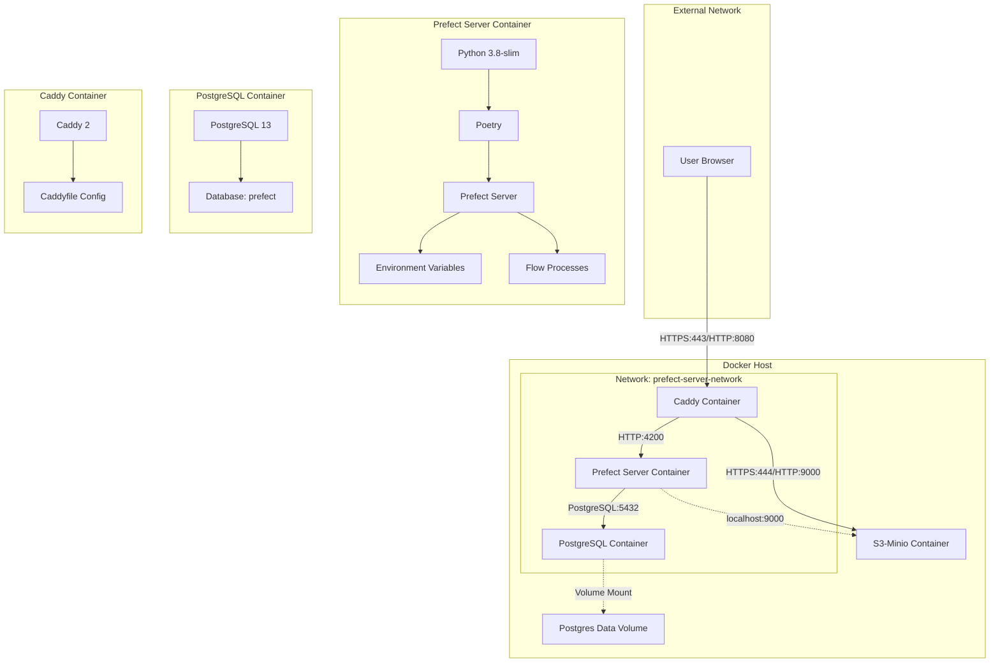
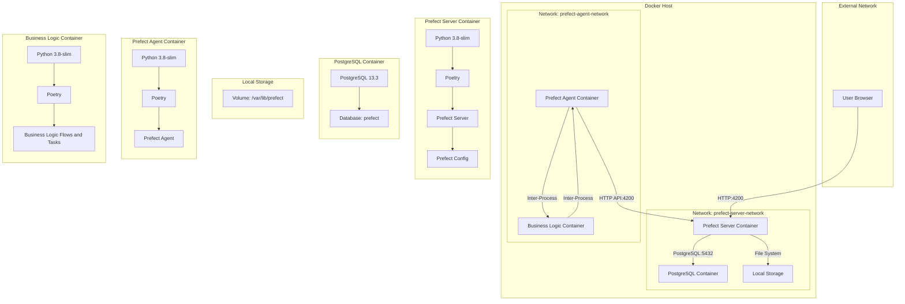

# V2 


## Design Principles
- Assume on-premises deployment
- Assume centralized experiment tracking for in-house experiments and SaaS
This document walks through the modules, their design patterns, and interactions with each other.
- Anticipate future needs for scaling, to be managed via Prefect
    - done via moving workers to a kuberneters or higher-compute server
    - add DB storage to domain model (currently a simple pandas table)


## Orchestration Services
We built the orchestration services with a few key technologies:

- Prefect: For orchestrating and managing data workflows.
- PostgreSQL: As the database for storing Prefect metadata.
- Caddy: For reverse proxy, HTTPS termination, and serving static files.
Network Architecture
- Prefect Network: This network includes the Prefect server, PostgreSQL database, and Caddy reverse proxy.

## Containers
### Prefect Server Container:

- Base Image: Python 3.8-slim
- Dependencies: Poetry, Prefect, SQLAlchemy, asyncpg
- Configuration: Prefect server configuration files
- Ports: Exposes port 4200 for the Prefect API and UI

### PostgreSQL Container:

- Image: PostgreSQL 13
- Database: Prefect metadata database

### Caddy Container:
- Image: Caddy 2
- Configuration: Caddyfile for reverse proxy and static file serving
- Ports: Exposes ports 80 and 443 for HTTP and HTTPS traffic

### User Browser to Caddy Container:

- Connection Type: HTTPS
- Port Number: 443
- Description: Users access the Prefect UI and API through Caddy's reverse proxy.

### Caddy Container to Prefect Server Container:

- Connection Type: HTTP
- Port Number: 4200
- Description: Caddy forwards requests to the Prefect server.

### Prefect Server Container to PostgreSQL Container:

- Connection Type: PostgreSQL
- Port Number: 5432
- Description: The Prefect server connects to the PostgreSQL database.

### Caddy Container to Local File System:

- Connection Type: File System
- Description: Caddy serves static flow files from a mounted local directory.

## Configuration Files

### docker-compose.dev_server.yml
- Defines three services: prefect-server, postgres, and caddy
- Sets up a shared network called prefect-server-network
- Configures environment variables for the Prefect server
- Sets up volume mounts for persistent data storage
- Defines healthchecks for the postgres and prefect-server services
- Exposes necessary ports for each service

### Caddyfile
- Configures Caddy as a reverse proxy for the Prefect server
- Sets up HTTPS with automatic certificate management
- Defines routing rules for API requests, static file serving, and UI access
- Enables gzip compression for better performance

### prefect_server.Dockerfile
- Uses Python 3.8-slim as the base image
- Installs system dependencies and Python packages using Poetry
- Copies configuration files and sets up the Prefect server
- Defines a healthcheck for the Prefect server
- Sets the entrypoint and default command to start the Prefect server


# Prefect Basics: Understanding Flows, Deployments, Work Pools, and Work Queues

## Introduction

Prefect is a modern workflow management system designed to handle complex data pipelines and task orchestration. It provides a robust set of tools for building, scheduling, and monitoring workflows. This document will explain the key concepts of Prefect: Flows, Deployments, Work Pools, and Work Queues.

## Flows

A Flow is the core building block of Prefect workflows. It represents a collection of tasks that are executed in a specific order to achieve a desired outcome.

Key characteristics of Flows:
- Flows are defined using Python code
- They can contain multiple tasks with dependencies
- Flows handle the overall logic and structure of a workflow

Example of a simple Flow:

```python
from prefect import flow, task

@task
def say_hello(name):
    print(f"Hello, {name}!")

@flow
def greeting_flow(name):
    say_hello(name)

greeting_flow("Alice")
```

## Deployments

A Deployment is a way to package and configure a Flow for execution. It allows you to specify how, when, and where a Flow should run.

Key aspects of Deployments:
- They associate a Flow with specific runtime configurations
- Deployments can include schedules, parameters, and infrastructure details
- They enable version control and reproducibility of Flow runs

Example of creating a Deployment:

```python
from prefect.deployments import Deployment
from prefect.server.schemas.schedules import CronSchedule

deployment = Deployment.build_from_flow(
    flow=greeting_flow,
    name="scheduled-greeting",
    schedule=CronSchedule(cron="0 0 * * *"),
    parameters={"name": "Bob"}
)
deployment.apply()
```

## Work Pools

Work Pools are a way to organize and manage the infrastructure where your Flows run. They act as a layer of abstraction between your Flows and the underlying compute resources.

Key features of Work Pools:
- They define the execution environment for Flows
- Work Pools can represent different types of infrastructure (e.g., Kubernetes clusters, AWS ECS)
- They allow for efficient resource allocation and management

## Work Queues

Work Queues are subsets of Work Pools that allow for more granular control over how work is distributed and prioritized.

Important aspects of Work Queues:
- They help in organizing and prioritizing work within a Work Pool
- Work Queues can be used to group related Flows or to separate different types of workloads
- They provide a way to control concurrency and manage resource utilization

## Relationship Between Components

1. Flows are the core workflows you define.
2. Deployments package Flows with specific configurations.
3. Work Pools provide the infrastructure where Flows run.
4. Work Queues organize and prioritize work within Work Pools.

When you create a Deployment, you typically associate it with a specific Work Pool and optionally a Work Queue. This determines where and how the Flow will be executed when it's time to run.

# Learning Notes

## Caddy Reverse proxy - 80 not localhost

1. `localhost` vs `:80`:
   - `localhost` in a Caddyfile typically binds to both IPv4 and IPv6 loopback addresses (127.0.0.1 and ::1) on the default HTTP port (80).
   - `:80` tells Caddy to listen on all available network interfaces (0.0.0.0) on port 80.

2. Docker networking:
   - In a Docker environment, `localhost` inside a container refers to the container itself, not the host machine or other containers.
   - When you use `:80`, it allows the container to listen on all interfaces, including the Docker network interface.

3. Container accessibility:
   - With `localhost`, Caddy was only listening for connections coming from inside its own container.
   - With `:80`, Caddy is now listening for connections from any source, including other containers and the host machine.

4. Port mapping:
   - Your Docker Compose file maps port 80 of the Caddy container to port 8080 on the host (`"8080:80"`).
   - By using `:80` in the Caddyfile, you're ensuring that Caddy is listening on the correct port that's being mapped.

5. Network isolation:
   - Docker creates a separate network for your containers. Using `:80` allows Caddy to be accessible within this Docker network.

In essence, changing to `:80` made Caddy listen on all interfaces on port 80 inside its container. This allows it to receive traffic from the Docker network, which is crucial for the reverse proxy to work correctly in a containerized environment.

The `localhost` configuration was too restrictive for a Docker setup, essentially making Caddy unreachable from outside its own container. The `:80` configuration opens it up to be reachable from other containers and the host, which is typically what you want in a Docker-based reverse proxy setup.
---

# Prefect Infrastructure V1 



## Tech Stack

Here is a summary of the technologies used:

- **Prefect**: For orchestrating and managing data workflows.
- **PostgreSQL**: As the database for storing Prefect metadata.
- **Local Storage**: For storing artifacts generated by Prefect flows.
- **Docker**: For containerizing the services.
- **Docker Compose**: For orchestrating multi-container Docker applications.

## System Architecture V1

### Design Principles

- assume on prem deployment
- assume centralized experiment tracking for inhouse experiments and SaaS

This document walks through the modules, their design patterns, and interactions with each other.

## Orchaestration Services

We built the orcahestration services with a few key technologies:
- **Prefect**: For orchestrating and managing data workflows.
- **PostgreSQL**: As the database for storing Prefect metadata.
- **Local Storage**: For storing artifacts generated by Prefect flows.
- (for later: Caddy for reverse proxy / https)


### Network Architecture

- **Prefect Network**: This network includes the Prefect server, PostgreSQL database, and local storage for artifacts.
- **Agent Network**: This network includes the Prefect agent and business logic containers. The business logic container will later be detached.

### Containers

1. **Prefect Server Container**:
   - **Base Image**: Python 3.8-slim
   - **Dependencies**: Poetry, Prefect, SQLAlchemy, asyncpg
   - **Configuration**: Prefect server configuration files
   - **Ports**: Exposes port 4200 for the Prefect UI

2. **PostgreSQL Container**:
   - **Image**: PostgreSQL 13.3
   - **Database**: Prefect metadata database

3. **Local Storage**:
   - **Volume**: Mounted volume for storing artifacts generated by Prefect flows

4. **Prefect Agent Container**:
   - **Base Image**: Python 3.8-slim
   - **Dependencies**: Poetry, Prefect
   - **Configuration**: Prefect agent configuration files

5. **Business Logic Container**:
   - **Base Image**: Python 3.8-slim
   - **Dependencies**: Poetry, Prefect
   - **Configuration**: Business logic, flows, and tasks

### Connections

1. **User Browser to Prefect Server Container**:
   - **Connection Type**: HTTP
   - **Port Number**: 4200
   - **Description**: The user makes HTTP requests directly to the Prefect server container to access the Prefect UI and API.

2. **Prefect Server Container to PostgreSQL Container**:
   - **Connection Type**: Database Connection (PostgreSQL)
   - **Port Number**: 5432
   - **Description**: The Prefect server container connects to the PostgreSQL container to interact with the database for storing metadata and flow information.

3. **Prefect Server Container to Local Storage**:
   - **Connection Type**: File System (Volume Mount)
   - **Port Number**: N/A
   - **Description**: The Prefect server container stores artifacts in the local storage volume. This is a file system operation and does not involve network ports.

4. **Prefect Agent Container to Prefect Server Container**:
   - **Connection Type**: API (HTTP)
   - **Port Number**: 4200
   - **Description**: The Prefect agent container polls the Prefect server container for flow runs and reports their status via HTTP API requests.

5. **Prefect Agent Container to Business Logic Container**:
   - **Connection Type**: Internal Execution (Inter-Process Communication)
   - **Port Number**: N/A
   - **Description**: The Prefect agent container executes the flows and tasks defined in the business logic container. This is typically done through inter-process communication within the same network.

### Developments

On successful proof of concept, the follwing ugprades will be made:
- dev config upgrade for inclusion of reverse proxy for remote access to between server <-> agent / production (caddy?)
- prod configs for hosting of server on VM (likely a digital ocean droplet)


