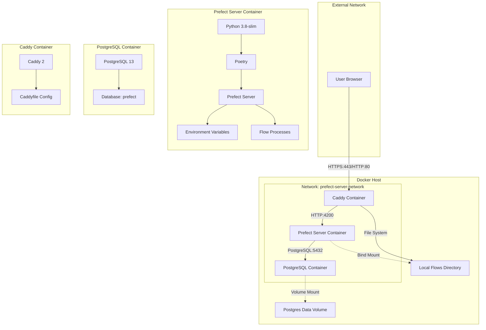
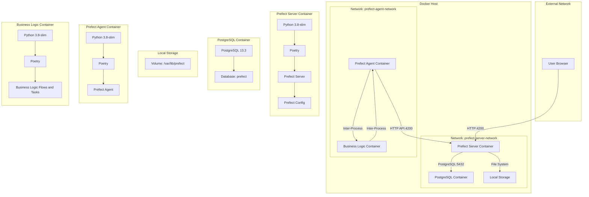

# V2 

## Design Principles
- Assume on-premises deployment
- Assume centralized experiment tracking for in-house experiments and SaaS
This document walks through the modules, their design patterns, and interactions with each other.

## Orchestration Services
We built the orchestration services with a few key technologies:

- Prefect: For orchestrating and managing data workflows.
- PostgreSQL: As the database for storing Prefect metadata.
- Caddy: For reverse proxy, HTTPS termination, and serving static files.
Network Architecture
- Prefect Network: This network includes the Prefect server, PostgreSQL database, and Caddy reverse proxy.

## Containers
### Prefect Server Container:

- Base Image: Python 3.8-slim
- Dependencies: Poetry, Prefect, SQLAlchemy, asyncpg
- Configuration: Prefect server configuration files
- Ports: Exposes port 4200 for the Prefect API and UI

### PostgreSQL Container:

- Image: PostgreSQL 13
- Database: Prefect metadata database

### Caddy Container:
- Image: Caddy 2
- Configuration: Caddyfile for reverse proxy and static file serving
- Ports: Exposes ports 80 and 443 for HTTP and HTTPS traffic

### User Browser to Caddy Container:

- Connection Type: HTTPS
- Port Number: 443
- Description: Users access the Prefect UI and API through Caddy's reverse proxy.

### Caddy Container to Prefect Server Container:

- Connection Type: HTTP
- Port Number: 4200
- Description: Caddy forwards requests to the Prefect server.

### Prefect Server Container to PostgreSQL Container:

- Connection Type: PostgreSQL
- Port Number: 5432
- Description: The Prefect server connects to the PostgreSQL database.

### Caddy Container to Local File System:

- Connection Type: File System
- Description: Caddy serves static flow files from a mounted local directory.

## Configuration Files

### docker-compose.dev_server.yml
- Defines three services: prefect-server, postgres, and caddy
- Sets up a shared network called prefect-server-network
- Configures environment variables for the Prefect server
- Sets up volume mounts for persistent data storage
- Defines healthchecks for the postgres and prefect-server services
- Exposes necessary ports for each service

### Caddyfile
- Configures Caddy as a reverse proxy for the Prefect server
- Sets up HTTPS with automatic certificate management
- Defines routing rules for API requests, static file serving, and UI access
- Enables gzip compression for better performance

### prefect_server.Dockerfile
- Uses Python 3.8-slim as the base image
- Installs system dependencies and Python packages using Poetry
- Copies configuration files and sets up the Prefect server
- Defines a healthcheck for the Prefect server
- Sets the entrypoint and default command to start the Prefect server

---

# Prefect Infrastructure V1 

## Tech Stack

Here is a summary of the technologies used:

- **Prefect**: For orchestrating and managing data workflows.
- **PostgreSQL**: As the database for storing Prefect metadata.
- **Local Storage**: For storing artifacts generated by Prefect flows.
- **Docker**: For containerizing the services.
- **Docker Compose**: For orchestrating multi-container Docker applications.

## System Architecture V1

### Design Principles

- assume on prem deployment
- assume centralized experiment tracking for inhouse experiments and SaaS

This document walks through the modules, their design patterns, and interactions with each other.

## Orchaestration Services

We built the orcahestration services with a few key technologies:
- **Prefect**: For orchestrating and managing data workflows.
- **PostgreSQL**: As the database for storing Prefect metadata.
- **Local Storage**: For storing artifacts generated by Prefect flows.
- (for later: Caddy for reverse proxy / https)

### Network Architecture

- **Prefect Network**: This network includes the Prefect server, PostgreSQL database, and local storage for artifacts.
- **Agent Network**: This network includes the Prefect agent and business logic containers. The business logic container will later be detached.

### Containers

1. **Prefect Server Container**:
   - **Base Image**: Python 3.8-slim
   - **Dependencies**: Poetry, Prefect, SQLAlchemy, asyncpg
   - **Configuration**: Prefect server configuration files
   - **Ports**: Exposes port 4200 for the Prefect UI

2. **PostgreSQL Container**:
   - **Image**: PostgreSQL 13.3
   - **Database**: Prefect metadata database

3. **Local Storage**:
   - **Volume**: Mounted volume for storing artifacts generated by Prefect flows

4. **Prefect Agent Container**:
   - **Base Image**: Python 3.8-slim
   - **Dependencies**: Poetry, Prefect
   - **Configuration**: Prefect agent configuration files

5. **Business Logic Container**:
   - **Base Image**: Python 3.8-slim
   - **Dependencies**: Poetry, Prefect
   - **Configuration**: Business logic, flows, and tasks

### Connections

1. **User Browser to Prefect Server Container**:
   - **Connection Type**: HTTP
   - **Port Number**: 4200
   - **Description**: The user makes HTTP requests directly to the Prefect server container to access the Prefect UI and API.

2. **Prefect Server Container to PostgreSQL Container**:
   - **Connection Type**: Database Connection (PostgreSQL)
   - **Port Number**: 5432
   - **Description**: The Prefect server container connects to the PostgreSQL container to interact with the database for storing metadata and flow information.

3. **Prefect Server Container to Local Storage**:
   - **Connection Type**: File System (Volume Mount)
   - **Port Number**: N/A
   - **Description**: The Prefect server container stores artifacts in the local storage volume. This is a file system operation and does not involve network ports.

4. **Prefect Agent Container to Prefect Server Container**:
   - **Connection Type**: API (HTTP)
   - **Port Number**: 4200
   - **Description**: The Prefect agent container polls the Prefect server container for flow runs and reports their status via HTTP API requests.

5. **Prefect Agent Container to Business Logic Container**:
   - **Connection Type**: Internal Execution (Inter-Process Communication)
   - **Port Number**: N/A
   - **Description**: The Prefect agent container executes the flows and tasks defined in the business logic container. This is typically done through inter-process communication within the same network.

### Developments

On successful proof of concept, the follwing ugprades will be made:
- dev config upgrade for inclusion of reverse proxy for remote access to between server <-> agent / production (caddy?)
- prod configs for hosting of server on VM (likely a digital ocean droplet)

