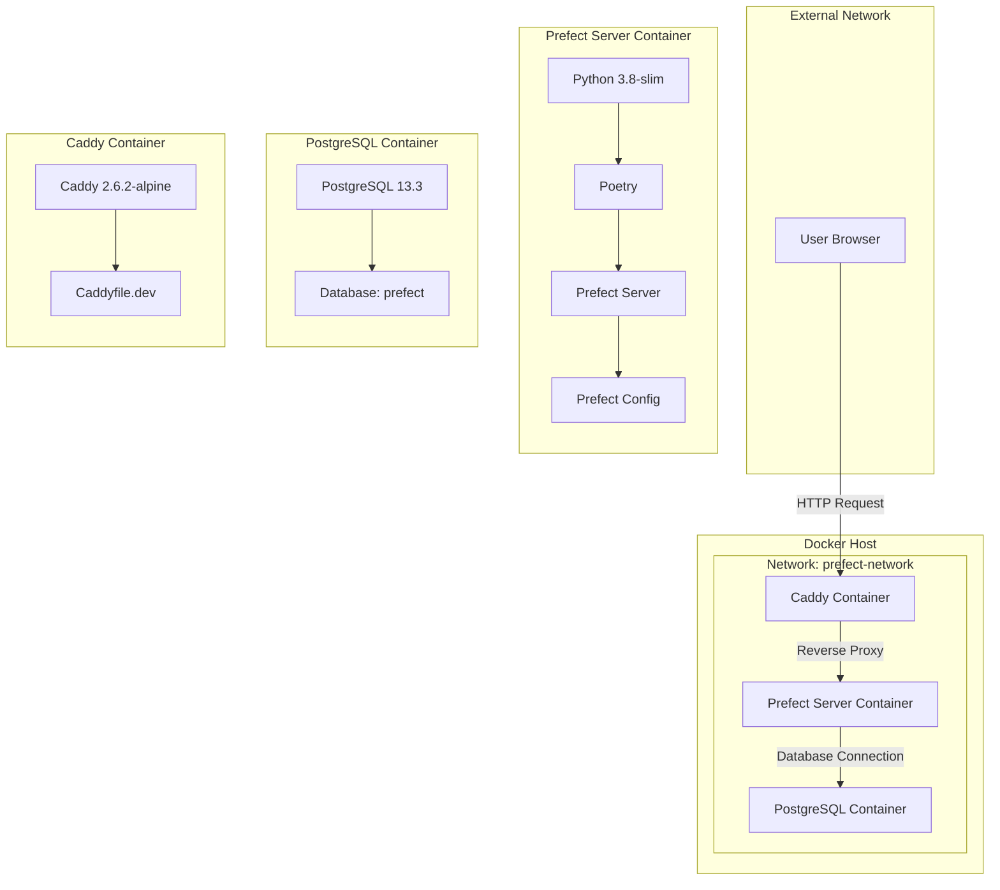

This is for the setup of infrastructure for mlops.

It covers:
- Prefect Server
- MLflow Server

For both, it has a dev env and prod env file.

All are managed via MAKEFILES

The directory structure is as follows: 

/prefect-deployment
  ├── docker-compose.yml
  ├── docker-compose.override.yml
  ├── Caddyfile
  ├── Caddyfile.local
  ├── .env
  ├── .env.local
  ├── Makefile
  ├── secrets/
  │   ├── postgres_db.txt
  │   ├── postgres_user.txt
  │   └── postgres_password.txt
  └── prefect/
      ├── Dockerfile
      ├── pyproject.toml
      ├── poetry.lock
      └── src/
          └── your_prefect_code/
              └── __init__.py

Connections
User Browser to Caddy Container: The user makes HTTP requests to the Caddy container.
Caddy Container to Prefect Server Container: The Caddy container acts as a reverse proxy, forwarding requests to the Prefect server container.
Prefect Server Container to PostgreSQL Container: The Prefect server container connects to the PostgreSQL container to interact with the database.
